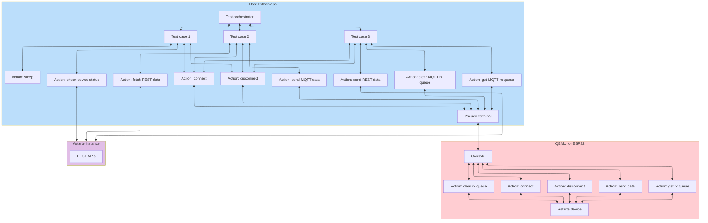

<!--
Copyright 2025 SECO Mind Srl

SPDX-License-Identifier: Apache-2.0
-->

# End to end tests

The end to end tests contained in this folder are intended to test the full Astarte device
functionality by interacting with a real Astarte instance.
The application code of the end to end tests can be run on real ESP hardware or through an
emulator (QEMU).

## Configuration

The `build_end_to_end.sh` script in the root of this repository is provided to facilitate building
and executing the end to end tests. A couple of configuration files should be filled in before
running the script.
- In this folder, the `config.toml` provides secrets to the Python application.
  Fill in the appropriate information about the Astarte device you would like to use
  for testing, you can also place your configuration in a `config.priv` file next to the
  `config.toml`. The `config.priv` will be gitignored and take precedence over the `config.toml`.
- In the app subfolder the `sdkconfig.defaults` provides secrets to the ESP application.
  Fill in the appropriate information about the Astarte device you would like to use
  for testing, you can also place your configuration in a `sdkconfig.priv` file next to the
  `sdkconfig.defaults`.
  The `sdkconfig.priv` will be gitignored and take precedence over the `sdkconfig.defaults`.
  Add the following entries.
  ```toml
  CONFIG_EXAMPLE_WIFI_SSID="" # If running on real hardware
  CONFIG_EXAMPLE_WIFI_PASSWORD="" # If running on real hardware

  CONFIG_ASTARTE_DEVICE_SDK_HOSTNAME=""
  CONFIG_ASTARTE_DEVICE_SDK_REALM_NAME=""

  CONFIG_DEVICE_ID=""
  CONFIG_CREDENTIAL_SECRET=""
  ```

## Tests architecture

The end to end tests have been designed to be as modular and extensible as possible.
We can divide the end to end tests into two applications:
- An ESP application. This application includes the Astarte device for ESP32 which is the component
  under test. This application performs various operations with the Astarte device which can be
  triggered through various console commands.
- A Python application. This application contains all the test logic. Test cases can be composed and
  run through this application. It interacts with the ESP application sending console commands
  through a pseudo terminal. Additionally, it interacts with the Astarte instance using its
  dedicated REST APIs.

The following structures are present in the Python application:
- A list of **test actions**, each test action performs an atomic action such as transmitting data
  through the device or reading data from the Astarte REST APIs.
- A set of **test cases**, each test case contains one or more test actions in a specific order.
  Each test case will focus on one test objective, testing some functionality of the Astarte device.
- A single **test orchestrator** which will contain all the test cases for the end to end tests
  and will take care of scheduling and executing them.

The following architecture diagram shows the full end to end test architecture.

